# Database Schema and Service Map

Source of truth: Supabase migrations in `supabase/migrations/`.

## ER Diagram (Mermaid)

```mermaid
erDiagram
  AUTH_USERS {
    UUID id PK
  }

  PROFILES {
    UUID id PK
  }

  COACH_PROFILES {
    UUID id PK
    UUID user_id FK
  }
  COACH_ATHLETES {
    UUID id PK
    UUID coach_id FK
    UUID athlete_user_id FK
  }
  COACH_INVITES {
    UUID id PK
    UUID coach_id FK
  }
  COACH_PROGRAMS {
    UUID id PK
    UUID coach_id FK
  }
  PROGRAM_ASSIGNMENTS {
    UUID id PK
    UUID program_id FK
    UUID coach_id FK
    UUID athlete_user_id FK
  }
  ASSIGNED_WORKOUTS {
    UUID id PK
    UUID assignment_id FK
    UUID athlete_user_id FK
  }
  COACH_EXERCISES {
    UUID id PK
    UUID coach_id FK
  }
  COACH_QUICK_WORKOUTS {
    UUID id PK
    UUID coach_id FK
  }
  QUICK_WORKOUT_ASSIGNMENTS {
    UUID id PK
    UUID quick_workout_id FK
    UUID coach_id FK
    UUID athlete_user_id FK
  }

  CHALLENGE_TEMPLATES {
    TEXT id PK
  }
  USER_CHALLENGES {
    UUID id PK
    TEXT template_id FK
    UUID user_id FK
  }

  LEAGUE_TIERS {
    INT id PK
  }
  LEAGUE_PERIODS {
    UUID id PK
  }
  LEAGUE_STANDINGS {
    UUID id PK
    UUID period_id FK
    INT tier_id FK
    UUID user_id FK
  }
  LEAGUE_XP_EVENTS {
    UUID id PK
    UUID period_id FK
    UUID user_id FK
  }

  GYMS {
    UUID id PK
  }
  GYM_MEMBERS {
    UUID id PK
    UUID gym_id FK
    UUID user_id FK
  }
  GYM_COACHES {
    UUID id PK
    UUID gym_id FK
    UUID coach_id FK
  }
  GYM_TRAFFIC {
    UUID id PK
    UUID gym_id FK
  }
  GYM_BUSYNESS_REPORTS {
    UUID id PK
    UUID gym_id FK
    UUID user_id FK
  }

  CUSTOM_EXERCISES {
    TEXT id PK
    TEXT normalized_name
    TEXT user_id
  }
  EXERCISE_PATTERNS {
    TEXT normalized_name PK
  }
  PROMOTED_EXERCISES {
    TEXT id PK
    TEXT normalized_name FK
  }

  USER_PUSH_TOKENS {
    UUID id PK
    UUID user_id FK
  }

  PARSED_PROGRAM_CACHE {
    TEXT content_hash PK
  }
  EXTRACTION_CACHE {
    TEXT content_hash PK
  }
  PDF_EXTRACTION_CACHE {
    UUID id PK
    TEXT content_hash
  }

  AUTH_USERS ||--|| PROFILES : has
  AUTH_USERS ||--o{ COACH_PROFILES : owns
  AUTH_USERS ||--o{ COACH_ATHLETES : athlete
  AUTH_USERS ||--o{ PROGRAM_ASSIGNMENTS : assigned_to
  AUTH_USERS ||--o{ ASSIGNED_WORKOUTS : completes
  AUTH_USERS ||--o{ QUICK_WORKOUT_ASSIGNMENTS : assigned_to
  AUTH_USERS ||--o{ USER_PUSH_TOKENS : registers
  AUTH_USERS ||--o{ USER_CHALLENGES : starts
  AUTH_USERS ||--o{ LEAGUE_STANDINGS : ranks
  AUTH_USERS ||--o{ LEAGUE_XP_EVENTS : earns
  AUTH_USERS ||--o{ GYM_MEMBERS : joins
  AUTH_USERS ||--o{ GYM_BUSYNESS_REPORTS : reports

  COACH_PROFILES ||--o{ COACH_ATHLETES : manages
  COACH_PROFILES ||--o{ COACH_INVITES : issues
  COACH_PROFILES ||--o{ COACH_PROGRAMS : creates
  COACH_PROGRAMS ||--o{ PROGRAM_ASSIGNMENTS : assigned
  PROGRAM_ASSIGNMENTS ||--o{ ASSIGNED_WORKOUTS : schedules
  COACH_PROFILES ||--o{ COACH_EXERCISES : defines
  COACH_PROFILES ||--o{ COACH_QUICK_WORKOUTS : creates
  COACH_QUICK_WORKOUTS ||--o{ QUICK_WORKOUT_ASSIGNMENTS : assigned
  COACH_PROFILES ||--o{ QUICK_WORKOUT_ASSIGNMENTS : assigns

  CHALLENGE_TEMPLATES ||--o{ USER_CHALLENGES : instantiates

  LEAGUE_PERIODS ||--o{ LEAGUE_STANDINGS : contains
  LEAGUE_TIERS ||--o{ LEAGUE_STANDINGS : tier
  LEAGUE_PERIODS ||--o{ LEAGUE_XP_EVENTS : logs

  GYMS ||--o{ GYM_MEMBERS : has
  GYMS ||--o{ GYM_COACHES : staffs
  GYMS ||--o{ GYM_TRAFFIC : tracks
  GYMS ||--o{ GYM_BUSYNESS_REPORTS : reports
  COACH_PROFILES ||--o{ GYM_COACHES : assigned

  EXERCISE_PATTERNS ||--o{ PROMOTED_EXERCISES : promotes
```

## Service Module Map (Tables and Functions)

- `lib/services/coach/programs.ts`: `coach_programs`, `program_assignments`, `assigned_workouts`, `coach_quick_workouts`, `quick_workout_assignments`.
- `lib/services/coach/invites.ts`: `coach_invites`, `coach_athletes`, `coach_profiles`, RPCs `generate_invite_code`, `accept_coach_invite`.
- `lib/services/coach/exercises.ts`: `coach_exercises`, `coach_profiles`, `coach_athletes`, RPC `increment_coach_exercise_usage` (expected).
- `lib/services/coach/profile.ts`: `coach_profiles`, `coach_athletes`, views `coach_dashboard`, `athlete_coaches`.
- `lib/services/leagues/tier-system.ts`: `league_tiers`, `league_periods`, `league_standings`, `league_xp_events`, RPCs `add_league_xp`, `get_user_standing`.
- `lib/services/sync/workout-sync.ts`: `workout_logs`, `workout_log_exercises`.
- `lib/services/notifications/push-service.ts`: `user_push_tokens`.
- `lib/services/exercise/custom-exercises.ts`: `custom_exercises`, `exercise_patterns`, `promoted_exercises`.
- `lib/services/gym/gym-membership-service.ts`: `gyms`, `gym_members`, RPC `increment_visits` (expected).
- `lib/services/sync/popularity-sync.ts`: `popularity_cache`.
- `lib/services/parser/pdf/service.ts`: `parsed_program_cache` via Edge Functions `parse-pdf-analyze` and `parse-pdf-extract`.
- `components/import/pdf-import-modal.tsx`: `pdf_extraction_cache` via Edge Function `extract-program-pdf`.
- `lib/services/voice/voice-direct-service.ts`: `extraction_cache` via Edge Function `extract-workout-data`.
- `supabase/functions/send-workout-reminders/index.ts`: `assigned_workouts`, `program_assignments`, `coach_profiles`, `user_push_tokens`, `profiles`.
- `supabase/functions/check-incomplete-workouts/index.ts`: `assigned_workouts`, `program_assignments`, `coach_profiles`, `user_push_tokens`, `profiles`.
- `supabase/functions/process-leagues/index.ts`: `league_periods`, `league_tiers`, `league_standings`.
- `supabase/functions/check-challenge-failures/index.ts`: `user_challenges`, `challenge_templates`.
- `supabase/migrations/20250115000000_profiles_and_rpcs.sql`: `profiles` table + RPCs `increment_visits`, `increment_coach_exercise_usage`, `increment_quick_workout_assigned`.

## Live Supabase Parity Check

Checked via PostgREST with the service role key.

Tables confirmed present in `public` that were missing from migrations in this repo:

- `users`, `programs`, `program_versions`, `workouts`, `exercises`, `exercise_database`, `install_links`, `user_profiles`, `workout_logs`, `workout_log_exercises`, `activities`, `workout_sessions`, `memberships`, `program_ratings`, `challenges`, `challenge_participants`, `popularity_cache`.

Tables missing in `public`:

- `profiles` (referenced in Edge Functions; migration added in `supabase/migrations/20250115000000_profiles_and_rpcs.sql`).

RPC functions missing:

- `increment_visits`
- `increment_coach_exercise_usage`
- `increment_quick_workout_assigned`

After applying `supabase/migrations/20250115000000_profiles_and_rpcs.sql`, these gaps should be resolved.
